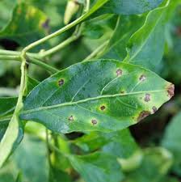

# CNN Plant Disease Classification

## Description

✔ Plant disease detection is a machine learning (ML) project that uses images to identify and diagnose diseases in plants.

✔ This can be helpful for farmers, plant enthusiasts, and researchers to monitor large fields of crops more easily and cheaply.

✔ The project uses traditional ML techniques, such as feature extraction and classification, to train a classifier that can differentiate between healthy and diseased plants.

✔ The classifier is trained on a dataset of images of healthy and diseased plants collected under controlled conditions.

## Table of Contents (Optional)

If your README is long, add a table of contents to make it easy for users to find what they need.

- [Installation](#installation)
- [Usage](#usage)
- [Credits](#credits)
- [License](#license)

## Installation

📌Kaggle Dataset Link: https://www.kaggle.com/datasets/abdallahalidev/plantvillage-dataset

📌pip install tensorflow

📌pip install numpy

📌pip install streamlit

📌pip install kaggle

## Usage

🍀 The project has the potential to contribute to more sustainable agricultural practices and greater food production security.
 

🍀 By detecting plant diseases early, farmers can take steps to prevent the spread of the disease and save their crops.

### Test Image

###Prediction
<a>  <a/>

